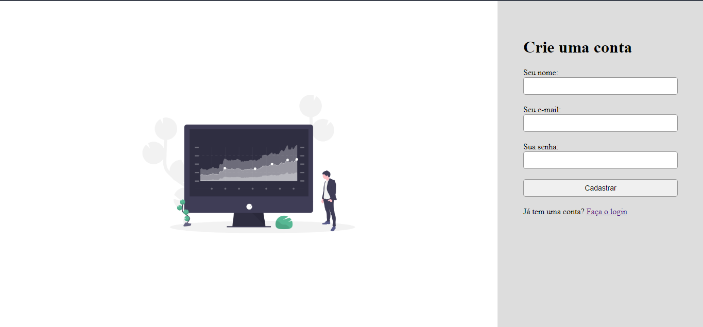

# FORMULÀRIO 

## Descrição

 Este projeto consiste em um formulário interativo para cadastro de usuários, implementado com HTML, CSS e JavaScript. O objetivo principal é criar um formulário responsivo e dinâmico que valide as entradas do usuário em tempo real, garantindo que os dados inseridos sejam adequados antes de serem enviados.

## Captura do Projeto

 

## Funcionalidades

-   Interface gráfica para simular um formulário
-   requisitos de e-mail, senha - por exemplo mínimo de caracteres e Regex

## Tecnologias Utilizadas

-   **Linguagem:** JavaScript
-   **Frontend:** HTML5, CSS3
-   **Bibliotecas:** Nenhuma (JavaScript puro)
-   **Controle de Versão:** Git

## Como Executar o Projeto

1.  **Clone o repositório**:
    
    bash
    
    Copiar código
    
    `git clone https://github.com/seu-usuario/form_project.git` 
    
2.  **Navegue até o diretório do projeto**:
    
    bash
    
    Copiar código
    
    `cd projeto-form_project` 
    
3.  **Abra o arquivo `index.html` no seu navegador** para visualizar e interagir com a urna eletrônica.

## Contribuindo

Se você deseja contribuir com melhorias ou correções para este projeto, siga os passos abaixo:

## Licença

